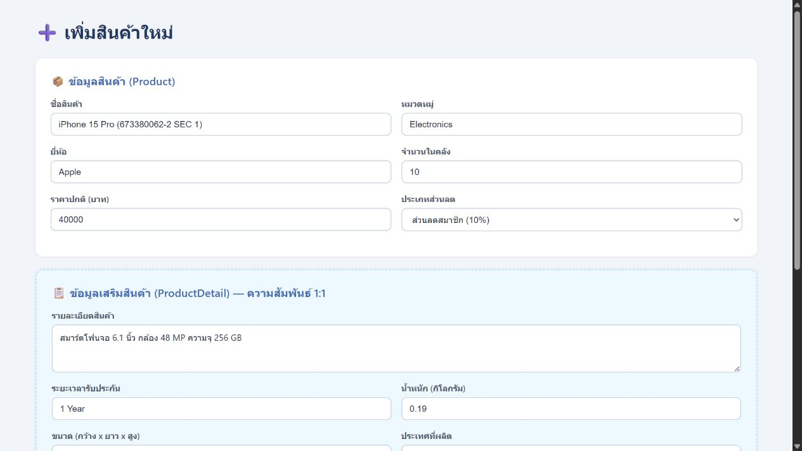
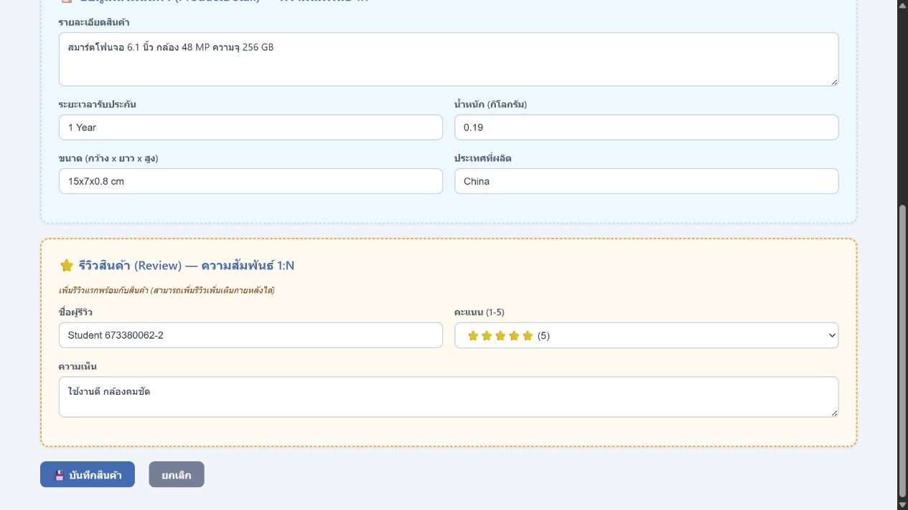
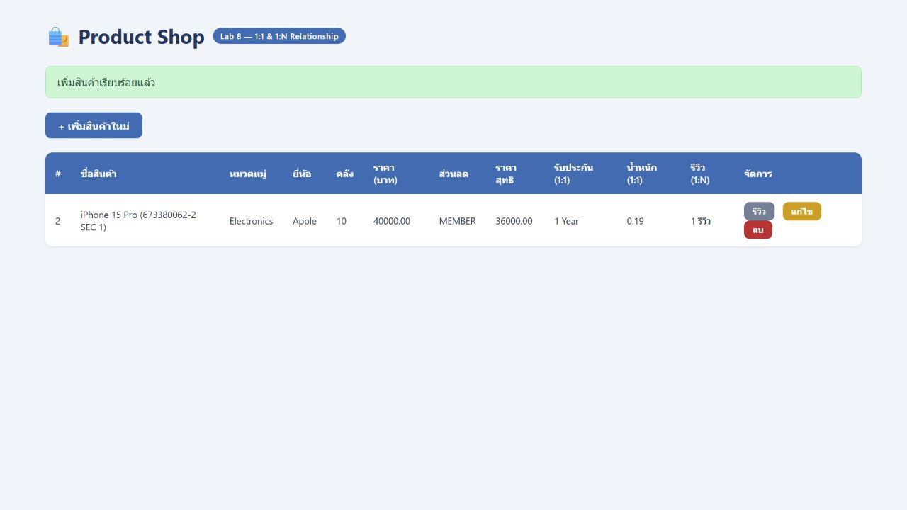
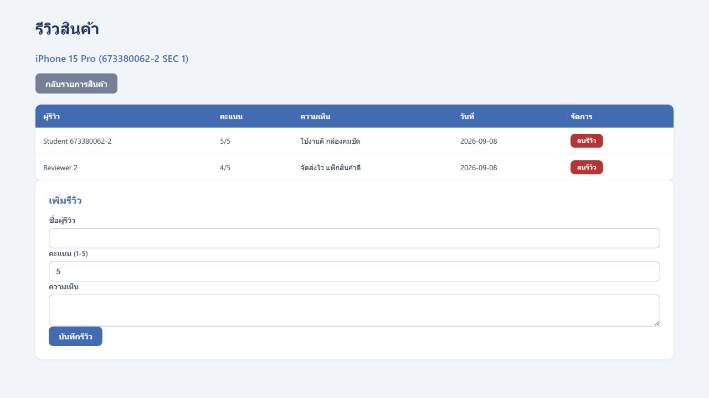
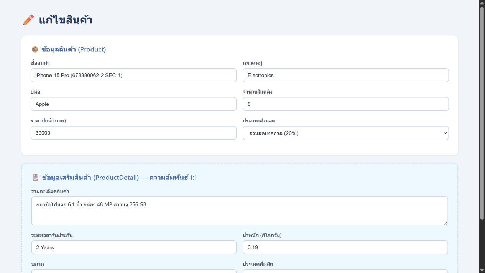
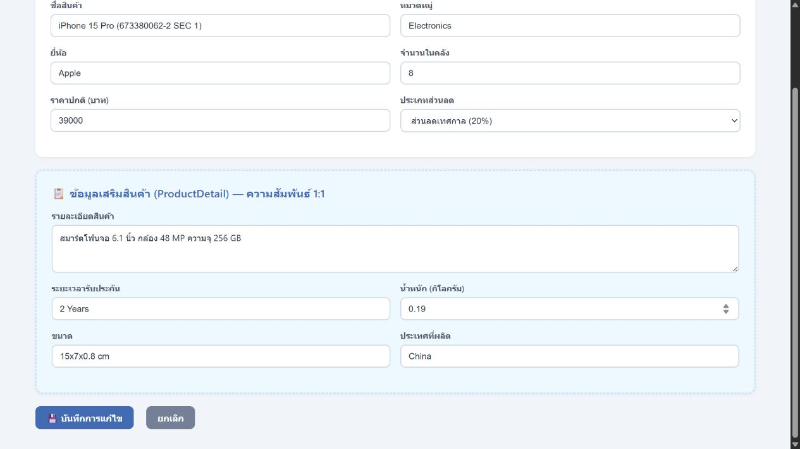
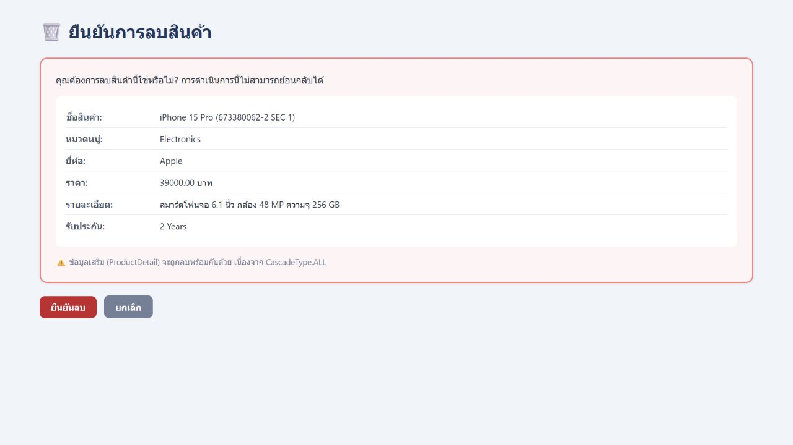
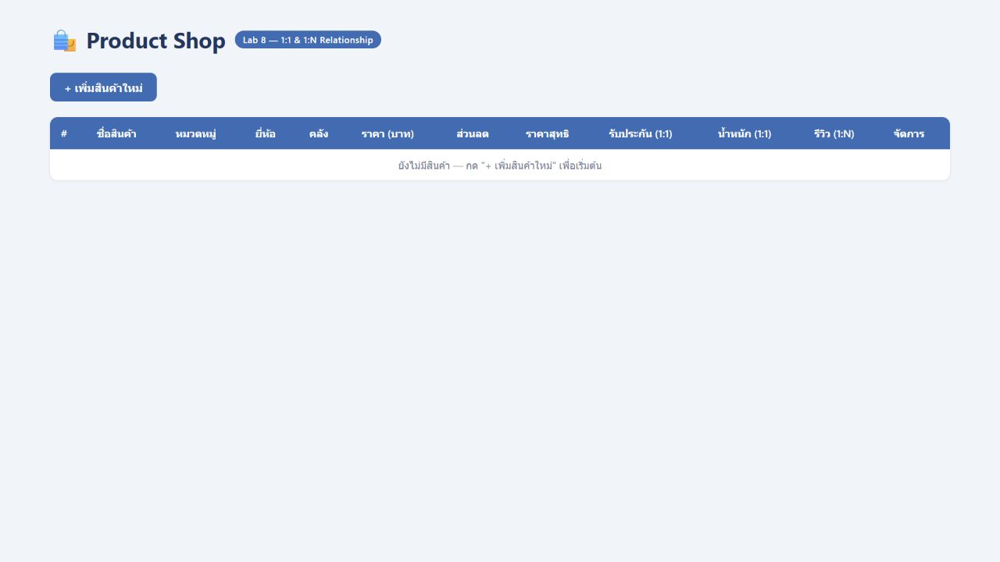
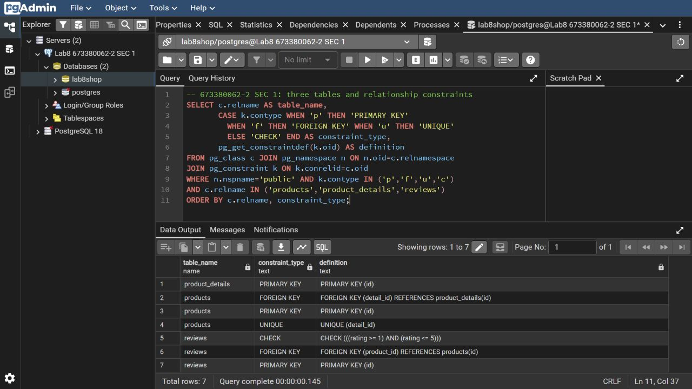

# Lab 8: Table Relationships - Product Shop

รายวิชา CP353002 Principles of Software Design

- รหัสนักศึกษา: 673380062-2
- Section: 1
- Repository: [lab8-673380062-2-sec1](https://github.com/Pangkeek/lab8-673380062-2-sec1)
- โจทย์ต้นฉบับ: [LAB08_Table_Relationships](https://github.com/PANANG6425/LAB08_Table_Relationships)

โปรเจกต์นี้เป็นระบบจัดการสินค้า พัฒนาด้วย Spring Boot, Spring Data JPA, Thymeleaf และ PostgreSQL โดยแสดงการใช้งานความสัมพันธ์ระหว่างตารางแบบ One-to-One และ One-to-Many

## ความสามารถของระบบ

- เพิ่ม แสดง แก้ไข และลบสินค้า
- บันทึกข้อมูลเสริมของสินค้า
- เพิ่มและลบรีวิวสินค้า
- สินค้าหนึ่งรายการมีรีวิวได้หลายรายการ
- คำนวณราคาหลังหักส่วนลดด้วย Strategy Pattern
- ตรวจสอบข้อมูลจากฟอร์มก่อนบันทึก
- ลบข้อมูลที่เกี่ยวข้องด้วย JPA Cascade

## เทคโนโลยีที่ใช้

- Java 17
- Spring Boot 3.3.0
- Spring MVC
- Spring Data JPA
- Thymeleaf
- PostgreSQL
- Maven
- HTML และ CSS

## Table Relationships

### One-to-One

สินค้า 1 รายการมีข้อมูลเสริมได้ 1 รายการ

```text
Product (1) -------- (1) ProductDetail
```

ตาราง `products` เก็บ Foreign Key ชื่อ `detail_id` ซึ่งอ้างอิง `product_details.id`

```java
@OneToOne(cascade = CascadeType.ALL, orphanRemoval = true)
@JoinColumn(name = "detail_id", unique = true, nullable = false)
private ProductDetail detail;
```

ฝั่ง `ProductDetail` ใช้ `mappedBy` เนื่องจากไม่ได้เป็นฝั่งที่เก็บ Foreign Key

```java
@OneToOne(mappedBy = "detail")
private Product product;
```

### One-to-Many

สินค้า 1 รายการมีรีวิวได้หลายรายการ แต่ละรีวิวเป็นของสินค้าเพียง 1 รายการ

```text
Product (1) -------- (N) Review
```

ฝั่ง `Product` ใช้ `@OneToMany`

```java
@OneToMany(
    mappedBy = "product",
    cascade = CascadeType.ALL,
    orphanRemoval = true
)
private List<Review> reviews = new ArrayList<>();
```

ฝั่ง `Review` เก็บ Foreign Key ชื่อ `product_id`

```java
@ManyToOne(fetch = FetchType.LAZY, optional = false)
@JoinColumn(name = "product_id", nullable = false)
private Product product;
```

## Database Structure

ระบบประกอบด้วย 3 ตาราง

### products

เก็บข้อมูลหลักของสินค้า

- `id`
- `name`
- `category`
- `brand`
- `stock`
- `price`
- `discount_type`
- `detail_id`

### product_details

เก็บข้อมูลเสริมของสินค้า

- `id`
- `description`
- `warranty`
- `weight`
- `dimensions`
- `manufactured_country`

### reviews

เก็บข้อมูลรีวิวสินค้า

- `id`
- `reviewer`
- `rating`
- `comment`
- `review_date`
- `product_id`

คะแนนรีวิวถูกจำกัดให้อยู่ระหว่าง 1 ถึง 5

## Strategy Pattern

ระบบใช้ Strategy Pattern สำหรับคำนวณราคาหลังหักส่วนลด

| ประเภท | ส่วนลด |
|---|---:|
| `NONE` | 0% |
| `MEMBER` | 10% |
| `SEASONAL` | 20% |

Strategy ที่ใช้ประกอบด้วย

- `DiscountStrategy`
- `NoDiscountStrategy`
- `MemberDiscountStrategy`
- `SeasonalSaleStrategy`
- `DiscountContext`

ตัวอย่างการคำนวณ

```text
ราคาปกติ 40,000 บาท
MEMBER ลด 10%
ราคาสุทธิ = 40,000 × 0.90 = 36,000 บาท
```

## SOLID Principles

- **Single Responsibility Principle:** แยก Model, Repository, Service และ Controller ตามหน้าที่
- **Open/Closed Principle:** สามารถเพิ่ม Discount Strategy ใหม่โดยไม่ต้องแก้ Strategy เดิม
- **Liskov Substitution Principle:** Strategy แต่ละชนิดสามารถใช้งานผ่าน `DiscountStrategy` ได้
- **Interface Segregation Principle:** แยก Repository และ Strategy Interface ตามหน้าที่
- **Dependency Inversion Principle:** Service ขึ้นกับ Repository Interface และรับ Dependency ผ่าน Constructor

## Project Structure

```text
src/main/java/com/example/demo/
├── DemoApplication.java
├── controller/
│   └── ProductController.java
├── form/
│   ├── ProductForm.java
│   ├── DetailForm.java
│   └── ReviewForm.java
├── model/
│   ├── Product.java
│   ├── ProductDetail.java
│   └── Review.java
├── repository/
│   ├── ProductRepository.java
│   ├── ProductDetailRepository.java
│   └── ReviewRepository.java
├── service/
│   └── ProductService.java
└── strategy/
    ├── DiscountStrategy.java
    ├── DiscountContext.java
    ├── NoDiscountStrategy.java
    ├── MemberDiscountStrategy.java
    └── SeasonalSaleStrategy.java
```

## URL Mappings

| Method | URL | รายละเอียด |
|---|---|---|
| GET | `/products` | แสดงรายการสินค้า |
| GET | `/products/add` | แสดงฟอร์มเพิ่มสินค้า |
| POST | `/products/save` | บันทึกสินค้า |
| GET | `/products/edit/{id}` | แสดงฟอร์มแก้ไข |
| POST | `/products/update/{id}` | บันทึกการแก้ไข |
| GET | `/products/delete/{id}` | แสดงหน้ายืนยันลบ |
| POST | `/products/delete/{id}` | ลบสินค้า |
| GET | `/products/{id}/reviews` | แสดงรีวิวสินค้า |
| POST | `/products/{id}/reviews` | เพิ่มรีวิว |
| POST | `/products/{id}/reviews/{reviewId}/delete` | ลบรีวิว |

## การตั้งค่าฐานข้อมูล

สร้างฐานข้อมูล PostgreSQL

```sql
CREATE DATABASE lab8shop;
```

กำหนดค่ารหัสผ่าน PostgreSQL ผ่าน Environment Variable

### PowerShell

```powershell
$env:DB_PASSWORD="รหัสผ่าน PostgreSQL"
```

หากต้องการกำหนดค่าการเชื่อมต่อเพิ่มเติม

```powershell
$env:DB_URL="jdbc:postgresql://localhost:5432/lab8shop"
$env:DB_USERNAME="postgres"
$env:PORT="8080"
```

ไม่ควรบันทึกรหัสผ่าน PostgreSQL ลงใน GitHub

## วิธีรันโปรเจกต์

### Windows

```powershell
.\mvnw.cmd spring-boot:run
```

### macOS หรือ Linux

```bash
./mvnw spring-boot:run
```

จากนั้นเปิดเว็บไซต์

```text
http://localhost:8080/products
```

## การทดสอบ

รันชุดทดสอบด้วยคำสั่ง

### Windows

```powershell
.\mvnw.cmd test
```

### macOS หรือ Linux

```bash
./mvnw test
```

ผลการทดสอบ

```text
Tests run: 6
Failures: 0
Errors: 0
Skipped: 0
```

ชุดทดสอบครอบคลุม

- การเพิ่ม แสดง แก้ไข และลบสินค้า
- ความสัมพันธ์ระหว่าง Product และ ProductDetail
- การเพิ่มรีวิวหลายรายการ
- การรักษารีวิวเดิมหลังแก้ไขสินค้า
- การตรวจคะแนนรีวิว 1-5
- การลบข้อมูลลูกด้วย Cascade
- การคำนวณส่วนลดทุกประเภท

## ตัวอย่างการทำงาน

### Create





### Read



### One-to-Many Reviews



### Update





### Delete





### Database Relationships



## รายงาน

[ดาวน์โหลดรายงาน Lab 8](docs/Lab08-Report-673380062-2-sec1.pdf)
